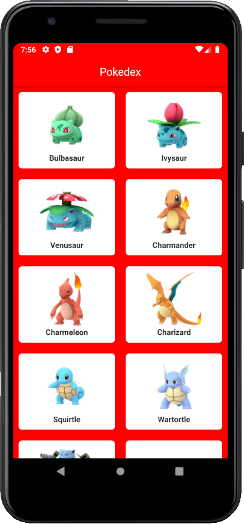

<h1 align="center" >
  Pokedex mobile
</h1>

<h3 align="center">Pokedex simples feita com react native consumindo uma api </h3>

<p align="center">
  
  
</p>

## 🚀 Tecnologias

Esse projeto foi desenvolvido com as seguintes tecnologias:

- [React Native](https://reactnative.dev/s)
- [Axios](https://redux-saga.js.org/)
- [Styled Components](https://styled-components.com/)
- [React Navigation Version 4.x](https://reactnavigation.org/docs/4.x/getting-started/)

## 💾 Instalação

```bash
# Clone o repositório
$ git clone https://github.com/rodrigosakamoto/Pokedex-mobile.git

$ cd Pokedex-mobile

# Em seguida execute:

$ yarn

$ yarn android
$ yarn start
```
---
By [Rodrigo Sakamoto](https://www.linkedin.com/in/rodrigo-sakamoto/)
